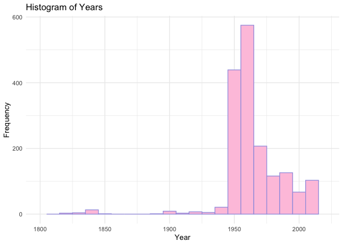

Lab 08 - University of Edinburgh Art Collection
================
Allison Li
03/26/2025

## Load Packages and Data

First, let’s load the necessary packages:

``` r
#install.packages("robotstxt")

library(robotstxt)
paths_allowed("https://collections.ed.ac.uk/art)")
```

    ## [1] TRUE

``` r
library(tidyverse) 
library(skimr)
library(ggplot2)
```

Now, load the dataset. If your data isn’t ready yet, you can leave
`eval = FALSE` for now and update it when needed.

``` r
# Remove eval = FALSE or set it to TRUE once data is ready to be loaded
uoe_art <- read_csv("data/uoe-art.csv")
```

## Exercise 9

Let’s start working with the **title** column by separating the title
and the date:

``` r
uoe_art <- uoe_art %>%
  separate(title, into = c("title", "date"), sep = "\\(") %>%
  mutate(year = str_remove(date, "\\)") %>% as.numeric()) %>%
  select(title, artist, year, link)  
```

    ## Warning: Expected 2 pieces. Additional pieces discarded in 48 rows [58, 85, 192, 268,
    ## 296, 478, 493, 538, 543, 610, 833, 948, 950, 1171, 1405, 1458, 1475, 1496,
    ## 1572, 1627, ...].

    ## Warning: Expected 2 pieces. Missing pieces filled with `NA` in 696 rows [3, 4, 10, 13,
    ## 15, 16, 17, 19, 30, 37, 42, 46, 49, 50, 68, 70, 74, 80, 82, 83, ...].

    ## Warning: There was 1 warning in `mutate()`.
    ## ℹ In argument: `year = str_remove(date, "\\)") %>% as.numeric()`.
    ## Caused by warning in `str_remove(date, "\\)") %>% as.numeric()`:
    ## ! NAs introduced by coercion

looking at the uoe_art dataset, there is the column “link.”

## Exercise 10

\#The warning “Additional pieces discarded in 48 rows…” is suggesting
that althought we are seperating the title into title text and date
text, some of them have more than these two information. I checked 58
and 85 and these rows have two parentheses, which is why it is showing
warning. For exmpale, 85 has a parenthesis showing the condition of the
art piece, which is broken. Therefore, it is ok for us to ignore this
warning since the data and variables are not affected. \#The warning
“Missing pieces filled with”NA” in 696 rows…” is suggesting that for
these rows the original title variable did not have years/ date of the
art work in. We can ignore the message since it automatically put “NA”
in these cells for the date variable.

## Exercise 11

``` r
skim(uoe_art)
```

|                                                  |         |
|:-------------------------------------------------|:--------|
| Name                                             | uoe_art |
| Number of rows                                   | 3312    |
| Number of columns                                | 4       |
| \_\_\_\_\_\_\_\_\_\_\_\_\_\_\_\_\_\_\_\_\_\_\_   |         |
| Column type frequency:                           |         |
| character                                        | 3       |
| numeric                                          | 1       |
| \_\_\_\_\_\_\_\_\_\_\_\_\_\_\_\_\_\_\_\_\_\_\_\_ |         |
| Group variables                                  | None    |

Data summary

**Variable type: character**

| skim_variable | n_missing | complete_rate | min | max | empty | n_unique | whitespace |
|:--------------|----------:|--------------:|----:|----:|------:|---------:|-----------:|
| title         |         0 |          1.00 |   0 |  95 |     5 |     1629 |          0 |
| artist        |       111 |          0.97 |   2 |  55 |     0 |     1198 |          0 |
| link          |         0 |          1.00 |  57 |  60 |     0 |     3312 |          0 |

**Variable type: numeric**

| skim_variable | n_missing | complete_rate |    mean |    sd |  p0 |  p25 |  p50 |  p75 | p100 | hist  |
|:--------------|----------:|--------------:|--------:|------:|----:|-----:|-----:|-----:|-----:|:------|
| year          |      1575 |          0.52 | 1964.56 | 53.14 |   2 | 1953 | 1962 | 1977 | 2020 | ▁▁▁▁▇ |

According to the summary, 111 art pieces have missing artist and 1575
has missing years.

## Exercise 12

``` r
ggplot(uoe_art, aes(x = year)) +
  geom_histogram(binwidth = 10, fill = "#fec6df", color = "#a39fe1") +
  scale_x_continuous(limits = range(1800:2020, na.rm = TRUE)) +
  labs(title = "Histogram of Years",
       x = "Year",
       y = "Frequency") +
  theme_minimal()
```

    ## Warning: Removed 1576 rows containing non-finite outside the scale range
    ## (`stat_bin()`).

    ## Warning: Removed 2 rows containing missing values or values outside the scale range
    ## (`geom_bar()`).

<!-- -->

According to the warning, I saw that some of the variables are outside
of the year range, which seems a little weird. I went checking the year
variable and saw that one piece work had the year as “2” in the
variable. Additionally, it seems like 1960s has yielded most of the art
pieces on this website.

## Exercise 13

\#As mentioned above, No.2548 has an out-of-the-ordinary year. I went to
the website and found that the accurate year is 1964, website link:
<https://collections.ed.ac.uk/art/record/21649?highlight=>*:*. I think
our code did not work because there are two parentheses that contains
numeric values for this work, and our code chose to scrape the first
numeric value, which is not the year.

``` r
## to correct the year, I would want to replace the original value to 1964.
uoe_art_correctyear <- uoe_art %>%
  mutate(
    year = case_when(
    year == 2 ~ 1964,
    TRUE ~ year
    ))

## histogram again
ggplot(uoe_art_correctyear, aes(x = year)) +
  geom_histogram(binwidth = 10, fill = "#fec6df", color = "#a39fe1") +
  labs(title = "Histogram of Years",
       x = "Year",
       y = "Frequency") +
  theme_minimal()
```

    ## Warning: Removed 1575 rows containing non-finite outside the scale range
    ## (`stat_bin()`).

<!-- -->

\##Exercise 14

``` r
most_artists <- uoe_art %>%
  count(artist, sort = TRUE) 

print(most_artists)
```

    ## # A tibble: 1,199 × 2
    ##    artist               n
    ##    <chr>            <int>
    ##  1 Unknown            373
    ##  2 Emma Gillies       175
    ##  3 <NA>               111
    ##  4 Ann F Ward          23
    ##  5 John Bellany        22
    ##  6 Zygmunt Bukowski    21
    ##  7 Boris Bućan         17
    ##  8 Marjorie Wallace    17
    ##  9 Gordon Bryce        16
    ## 10 William Gillon      16
    ## # ℹ 1,189 more rows

According to the “Unknown” artist, the artist that has the most work in
the collection is Emma Gillies. After searching her name, I think it is
because that she studied at Edinburgh College of Art and lived in the
city for her life.

\##Exercise 15

``` r
child_count <- uoe_art %>%
  filter(str_detect(title, "(?i)child")) %>%
  count()
print(child_count)
```

    ## # A tibble: 1 × 1
    ##       n
    ##   <int>
    ## 1    11

According to the table, there are 11 work with the word “children”
inside.
